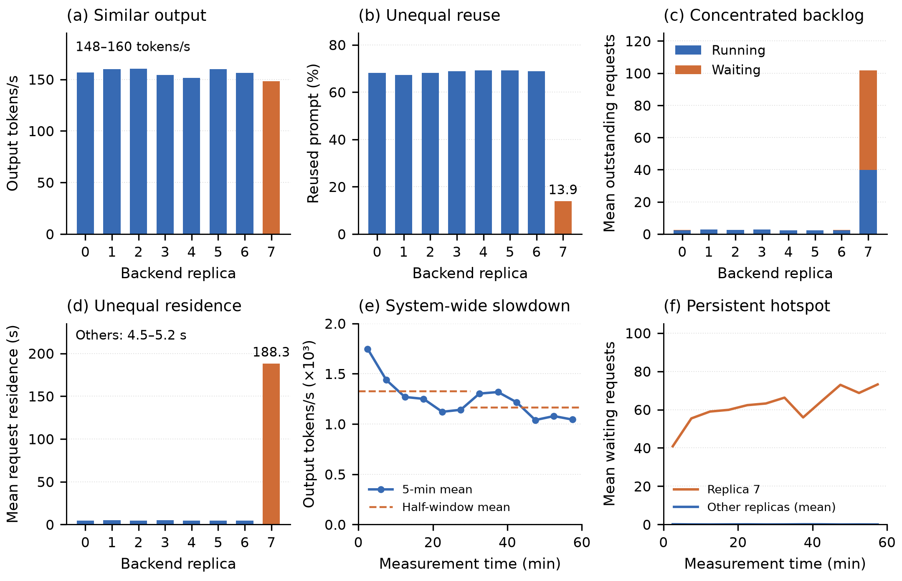
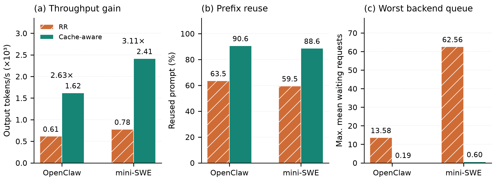

# Paper Insights

## Insight 1: State retention can limit concurrency scaling

Agentic workloads alternate between LLM calls and tool execution while repeatedly reusing growing histories, making efficient execution depend on inference state retained between calls. In hybrid architectures combining attention and recurrent layers, prefix reuse requires both attention KV and the corresponding recurrent state. In the evaluated vLLM implementation, both are managed through a shared block pool: historical state blocks become reclaimable when their reference counts reach zero, and subsequent allocations can evict their cached contents. Higher concurrency can intensify this competition, leaving attention KV available but the required recurrent state missing. The resulting loss of prefix reuse forces additional prefill and can reduce output throughput, making state retention across calls a key constraint on agent concurrency scaling.

## Insight 2: Agentic workloads can achieve nearly linear weak scaling

Agentic workloads can scale nearly linearly when frontend resources and independent inference replicas grow together, task concurrency per replica remains fixed, and tasks retain affinity to their backends. In our experiments, scaling from one to sixteen inference replicas with matching frontend resources achieves approximately 99–101% scaling efficiency in output token throughput across both workloads while maintaining prefix reuse. These results show that dependencies between agent steps and intervening tool execution need not prevent scaling across nodes: replicating a stable serving configuration preserves local cache and request supply conditions while increasing aggregate throughput.

## Insight 3: Frontend–backend provisioning must reflect tool and environment demand

Agentic serving requires workload-dependent frontend–backend ratios because tool execution and environment management shape the supply of requests to inference replicas. In our replay experiments with eight inference replicas, one frontend averages about 35% CPU utilization for OpenClaw but 96% for mini-SWE. For mini-SWE, adding a second frontend while keeping total task concurrency and the aggregate environment-creation limit unchanged improves output throughput by 8.2%. Increasing the creation limit on the existing frontend reduces explicit waiting but slows environment creation and tool execution, yielding no throughput gain. These results indicate that frontend resource contention can constrain inference throughput, and higher software concurrency cannot substitute for additional capacity once the frontend saturates. Frontend resources should therefore be provisioned according to aggregate tool and environment demand rather than a fixed ratio to inference replicas.

## Insight 4: Similar backend throughput can mask severe load imbalance

Round-robin routing equalizes request arrivals, but agentic calls can require very different amounts of computation depending on retained history. Local losses of prefix reuse increase prefill work and request residence time, potentially creating a feedback loop between backlog and cache pressure. With a fixed population of agents, calls stalled at a congested replica also delay subsequent agent steps and reduce request supply to other replicas. Similar output throughput can therefore coexist with sharply different queues and latencies: the congested replica limits overall progress while the others become limited by request supply. Routing imbalance can thus manifest as a system-wide throughput decline, making cache reuse, outstanding requests, and request residence time essential complements to throughput when evaluating routing policies.

*Figure 4. OpenClaw RR, one frontend and eight backends, CC128. Every backend receives 2,006 requests in the complete 60-minute measurement window; two timeouts occurred during warmup. Replica 7 has low reuse, long residence, and persistent queues despite similar output rates. Residence follows the arrival cohort through natural drain; (e–f) use five-minute means. Half-window output declines from 1,328 to 1,166 tokens/s, indicating nonsteady behavior.*

[Vector PDF](figures/paper-insights/04_rr_imbalance.pdf) · [Per-backend measurements](../reports/2026-09-22-routing-and-frontend/replica_diagnostics.csv) · [Arrival and residence measurements](../reports/2026-09-22-routing-and-frontend/routing_arrivals.json)

## Insight 5: Agentic routing must account for cache locality

Agentic workloads repeatedly reuse growing histories across LLM and tool phases, so the cost of a call depends on the cached state available at its destination. Routing therefore needs to account for cache locality together with load: a decision changes both where work executes and how much prefill is required. In our four-replica comparisons, cache-aware routing combines prefix affinity with load feedback, raising effective prefix reuse from approximately 59–63% under round-robin to 89–91% and achieving 2.63–3.11× its output throughput over the measured windows. These gains reflect the combined policy, highlighting the need to consider history reuse and congestion together to sustain agent progress.

*Figure 5. One frontend and four backends, using the same official router path. Cache-aware combines prefix affinity with load feedback. (c) Maximum across per-backend mean waiting counts, not an instantaneous peak. Hatched RR bars use complete measurement windows: OpenClaw is nonsteady, and mini-SWE's subsequent drain timed out. Ratios describe these observed windows, not isolated cache-affinity effects or repeated-run confidence estimates.*

[Vector PDF](figures/paper-insights/05_cache_aware.pdf) · [Routing comparison and scope](../reports/2026-09-22-routing-and-frontend/insights.md)
