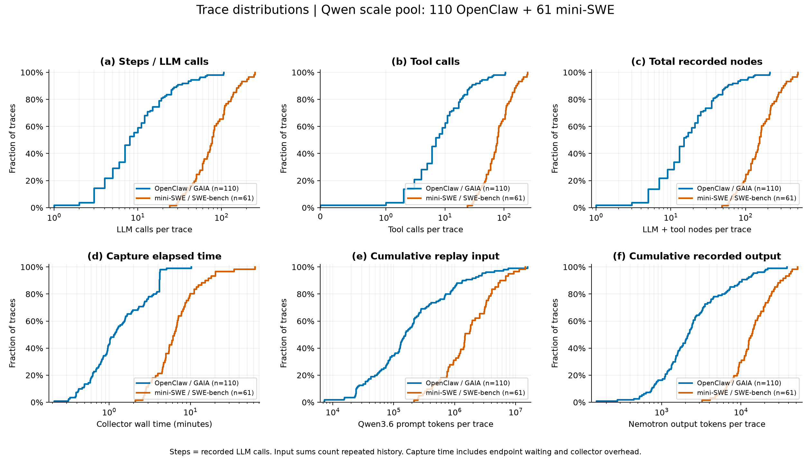
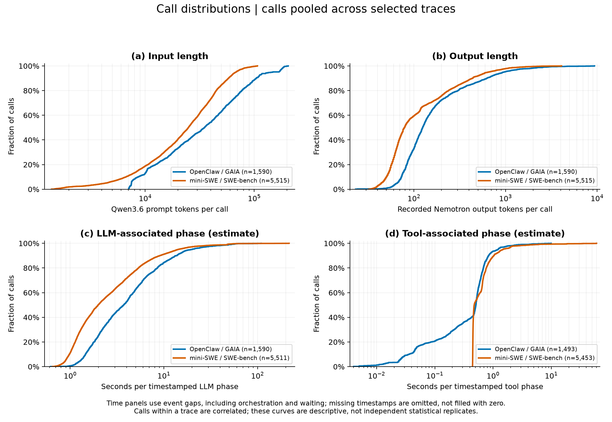
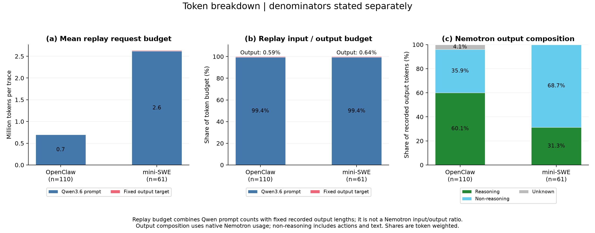
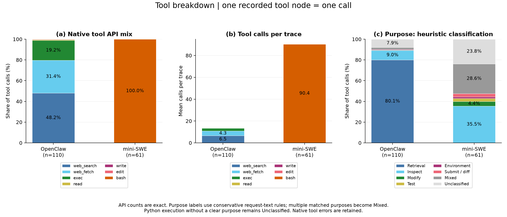
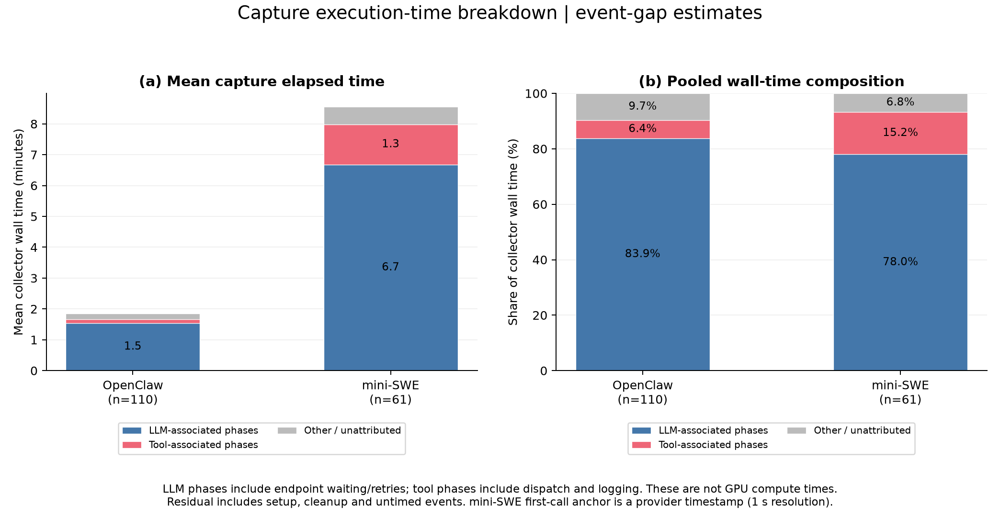
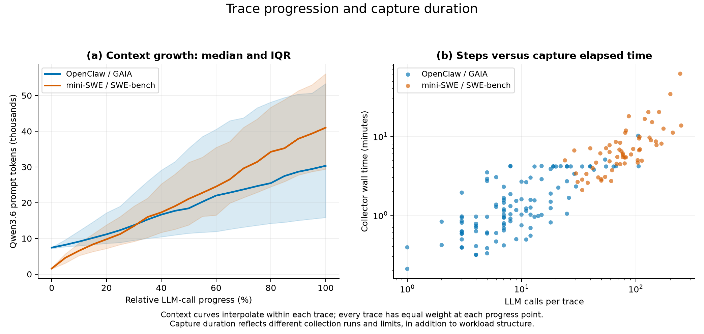

# 扩展 Trace 数据集分析（2026-09-08）

主图对齐本次 Qwen3.6 scale 实验池：**OpenClaw 110 条、mini-SWE 61 条**。每条原始 trace 仅统计一次，不重复累计不同 cc 的回放实例。

完整冻结集为 OpenClaw 115 条、mini-SWE 61 条；5 条含 `process` 的 OpenClaw trace 没有进入当前 replay pool。CSV 保留全部 176 条并提供 `scale_selected` 标记，图表使用选中集。

| 指标（每 trace） | OpenClaw：median [Q25, Q75] | mini-SWE：median [Q25, Q75] |
|---|---:|---:|
| Steps / LLM calls | 8.00 [5.00, 17.25] | 77.00 [54.00, 109.00] |
| Tool calls | 7.00 [4.00, 17.00] | 77.00 [54.00, 109.00] |
| 采集总耗时（分钟） | 1.15 [0.71, 2.83] | 6.33 [4.54, 8.94] |
| 累计 Qwen 输入（百万 tokens） | 0.16 [0.07, 0.53] | 1.49 [0.79, 3.29] |
| 累计原始输出（千 tokens） | 2.15 [1.32, 4.17] | 13.70 [9.30, 21.82] |

当前样本的主要差异：

- mini-SWE 的 steps 中位数为 77，OpenClaw 为 8；累计 Qwen 输入中位数分别为 1.486M 与 0.155M。两者都约相差 9.6 倍，而每任务最大 prompt 的中位数仅为 40,995 与 30,333，说明交互链长度是总请求负载差异的重要来源。
- 原始输出中已知 reasoning 占比：OpenClaw 60.1%，mini-SWE 31.3%；OpenClaw 另有 4.1% 输出组成未知。
- OpenClaw 原生工具调用主要是 web_search（48.2%）、web_fetch（31.4%）、exec（19.2%）；mini-SWE 全部为 bash，因此单看 API 类型无法区分代码阅读、修改和测试。
- 采集时间中 LLM 相关阶段占池内总耗时约 83.9% / 78.0%，工具相关阶段约 6.4% / 15.2%（OpenClaw / mini-SWE）。这是含等待与框架开销的采集侧估计，不能据此直接推断 Qwen replay 的瓶颈占比。

## 图表

[全部图表 PDF](trace_analysis.pdf)。每张图也提供独立 PNG 和矢量 PDF。

### 01_trace_distributions

任务级分布：steps 定义为 LLM calls；同时展示 tool calls、总节点数、采集耗时、累计输入和输出。ECDF 不依赖直方图分箱；横轴使用对数刻度以显示长尾。



[矢量 PDF](01_trace_distributions.pdf)

### 02_call_distributions

调用级分布：Qwen 输入、原始输出，以及有时间戳的 LLM/tool 阶段耗时。调用级曲线按调用汇总；同一 trace 中的调用不独立。



[矢量 PDF](02_call_distributions.pdf)

### 03_token_breakdown

Token breakdown：Qwen 输入 + 固定输出长度表示 replay 请求预算；输出的 reasoning / non-reasoning / unknown 表示 Nemotron 采集 usage 构成。两种口径不混称为原模型的输入输出比。



[矢量 PDF](03_token_breakdown.pdf)

### 04_tools_breakdown

Tools breakdown：原生 API 调用份额、每 trace 平均调用次数、命令用途的启发式分类。原生 API 统计精确；用途分类仅供初步探索，Mixed/Unclassified 保留不确定性。



[矢量 PDF](04_tools_breakdown.pdf)

### 05_execution_time_breakdown

执行时间 breakdown：按相邻事件时间戳划分 LLM 阶段、tool 阶段和其他/未归因；提供平均耗时和池内总耗时加权份额。



[矢量 PDF](05_execution_time_breakdown.pdf)

### 06_context_and_duration

上下文增长及 steps–耗时关系：每条 trace 按相对 LLM 进度插值，计算等权 median/IQR。不是把所有 calls 混在一起求进度曲线。



[矢量 PDF](06_context_and_duration.pdf)

## 统计口径与限制

- 采集模型为 ALCF Nemotron-3-Ultra；Qwen3.6 输入 token 使用此次已完成的 tokenizer preflight。累计输入重复计算每轮传入的历史上下文，表示请求输入负载，不是唯一信息量，也不是实际未命中 cache 的 prefill 量。
- 输出长度来自 trace 的 `output_tokens`。只有原生 usage 的输出总数与 trace 一致、reasoning 字段有效时才拆分；其他输出全部标为 unknown。Non-reasoning 包括工具参数与可见文本，不等于最终答案。未按消息角色近似拆分输入，以免将文本长度近似宣称为模板后的精确 token 构成。
- 完整集有 22 次 OpenClaw 调用的输出组成未知；主图选中集有 19 次。缺失原生输入 usage 在 CSV 中留空，未填零。Qwen preflight 输入覆盖全部选中 calls。
- 时间来自原始采集记录，不是当前 Qwen cc 实验的性能数据。`capture_wall_seconds` 使用 collector 的 elapsed_seconds；OpenClaw 是 agent 子进程耗时，mini-SWE 还覆盖环境准备、收尾和 trace 构建，二者边界并非完全相同。
- OpenClaw 从首条 user 消息的写入时间开始，使用每条消息外层 timestamp 作为事件完成时间。mini-SWE 使用 extra.timestamp；第一轮用 provider response.created 作为近似起点（秒级分辨率，跨端时钟可能有偏差）。后续所有阶段均采用相邻本地事件时间差。
- 每段时间只归给结束该区间的事件，避免并行工具按各自耗时相加导致重复计算。LLM 阶段可包含 endpoint 排队、重试和框架开销；tool 阶段也包含调度、结果包装和记录开销。因此不能把该图解释为纯 GPU 推理时间/纯工具服务时间，或逐工具的独立延迟。
- mini-SWE 有 2 个带 response 的 user-role 事件缺少时间戳；这些事件前后的间隔均不归给已知阶段。最终 Submitted 工具结果没有时间戳，耗时保留在其他/未归因中。其他项还覆盖首段之前、末段之后、环境启动、收尾与未观测间隔。缺失工具耗时不填零。
- 完整但失败、aborted 或 LimitsExceeded 的轨迹均保留；Submitted 不代表通过 SWE-bench 测试。OpenClaw 扩展批次采用约 240 秒上限，少量补采采用 600 秒，上限附近的堆积不能解释为自然任务耗时分布。不同采集批次的 endpoint 状态也不同。
- mini-SWE 混合 dev 与 test，且本次新增 test 按收集顺序停止，不是全 SWE-bench 的随机样本。这里描述当前 workload pool，不做任务总体代表性或显著性宣称。
- 堆叠图的百分比是池内 token/call/time 加权构成；breakdown.csv 同时提供每 trace 比例的等权平均。p90/p95 仅作为样本描述，未提供把调用当独立重复的置信区间。
- 命令用途分类采用脚本中公开的字符串规则，多个用途命中归 Mixed，未明确用途的 Python 执行归 Unclassified；不能直接作为已人工标注的论文结论。

## 数据文件与复现

- `tasks.csv`：全部冻结 trace 的逐任务指标、来源路径与选中标记。
- `llm_calls.csv` / `tool_calls.csv`：逐调用指标；缺失值为空。工具表保留截断的命令预览，便于复核启发式分类。
- `summary.csv`：选中池各指标的 n、mean、min、Q25、median、Q75、p90、p95、max。
- `inventory.csv`：完整集和 scale 子集的数量、调用数、终止状态与 split。
- `breakdown.csv` / `tool_summary.csv`：构成、工具覆盖率与原生错误率。
- `checks.json`：必要的数量、usage 分解、时间相加和路径检查；未生成或验证校验和。

```bash
MPLCONFIGDIR=/tmp/agenttrace-matplotlib .venv/bin/python reports/2026-09-08-expanded-trace-analysis/analyze.py
```

输入数据集：`/lus/eagle/projects/lc-mpi/ZhijingYe/SIGMETRICS_2027/datasets/scale-20260908-collected`。

输入 preflight/pool：`/lus/eagle/projects/lc-mpi/ZhijingYe/SIGMETRICS_2027/trace_framework/runs/scaling/qwen36-expanded-7594555-20260908/pools`。

脚本只读取本地 trace/原始轨迹/preflight，写本报告目录；不请求推理、不调用搜索 API、不改动正在执行的实验。
