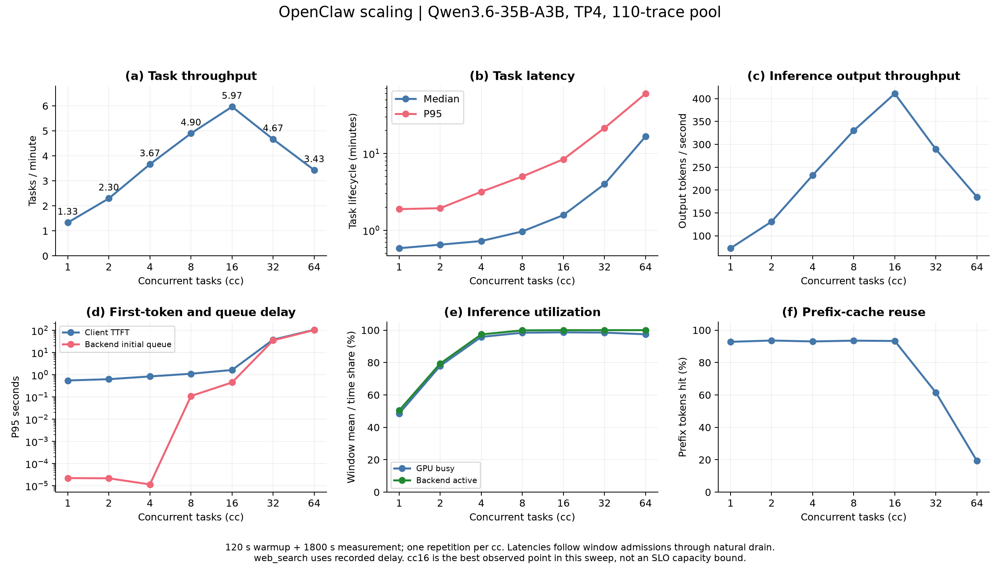
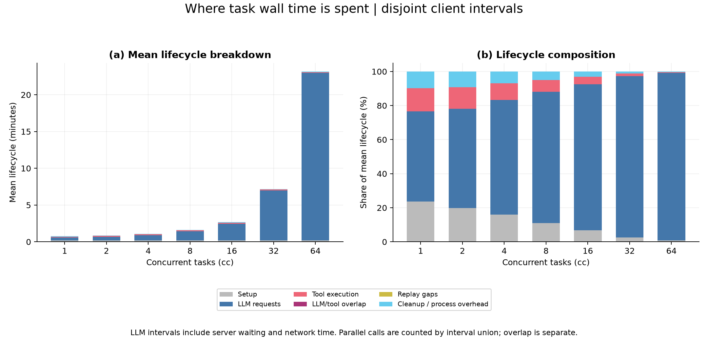
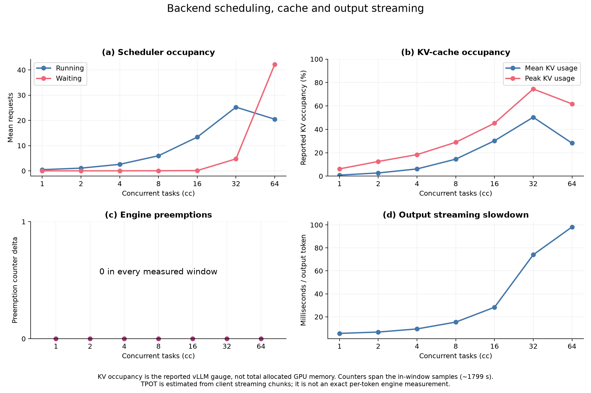
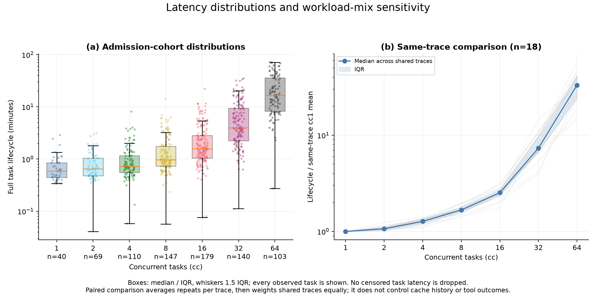
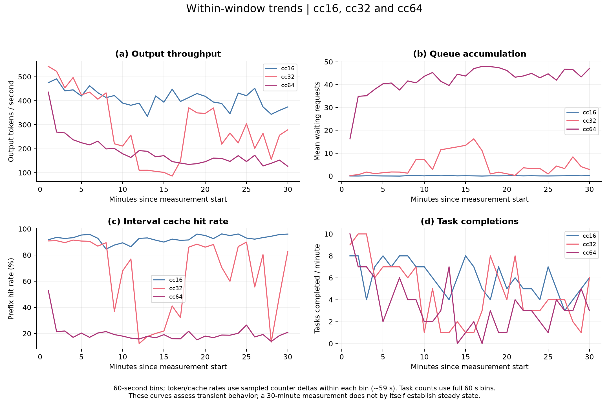
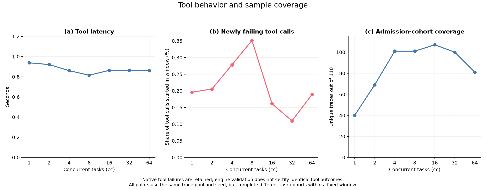

# OpenClaw 单推理节点 Scale 分析：Qwen3.6 TP4

**7 个点均完成并通过测量校验。当前 sweep 的吞吐峰值在 cc16；cc32/64 吞吐下降、延迟和排队上升。**

[全部图表 PDF](openclaw_scale.pdf) · [完整指标表](tables.md) · [汇总 CSV](summary.csv)

| cc | tasks/min | 任务 p95（分钟） | TTFT p95（秒） | Prefix hit |
|---:|---:|---:|---:|---:|
| 1 | 1.33 | 1.89 | 0.56 | 92.8% |
| 2 | 2.30 | 1.94 | 0.64 | 93.6% |
| 4 | 3.67 | 3.18 | 0.84 | 93.0% |
| 8 | 4.90 | 5.03 | 1.12 | 93.5% |
| 16 | 5.97 | 8.43 | 1.65 | 93.3% |
| 32 | 4.67 | 21.50 | 38.37 | 61.5% |
| 64 | 3.43 | 60.23 | 106.67 | 19.3% |

## 主要观察

- 吞吐从 cc1 的 1.33 tasks/min 上升到 cc16 的 5.97，为 4.48 倍；cc32/64 分别回落到 4.67/3.43，较 cc16 下降 21.8%/42.5%。这只是本次七档中观测到的最佳点，未进行重复试验或定义延迟 SLO。
- 后端窗口输出率同样在 cc16 达到 410.9 tokens/s，cc32/64 降到 289.2/184.9。下降同时出现在任务吞吐和后端 token 产出上，具体机制还需结合调度、缓存及请求组成进一步分析。
- 全七档共有的 18 条 trace 配对后，cc16/32/64 相对各自 cc1 延迟的中位倍数为 2.53/7.34/33.15。同一条任务也明显变慢，说明总体延迟上升不只是因为某些档位选中了更长任务；仍需注意这个小子集、缓存历史与重复次数不同。
- cc16 → cc32 → cc64 的任务 p95 为 8.43 → 21.50 → 60.23 分钟；客户端 TTFT p95 为 1.65 → 38.37 → 106.67 秒。初始调度排队 p95 同期升至 35.53/104.08 秒，表明高并发下明显存在后端等待。不同指标的 p95 不能相加。
- Prefix-cache token 命中率由 cc16 的 93.3% 降到 cc32 的 61.5%、cc64 的 19.3%；GPU busy 仍约 97.4%。GPU 保持活跃并不意味着有用输出保持高吞吐。缓存复用降低、队列积压与输出变慢同时出现，支持进一步研究调度/缓存行为；本次 sweep 尚不能单独证明某一种根因。
- 原始 Prometheus 中的引擎抢占计数增量（cc1→64）为 [0, 0, 0, 0, 0, 0, 0]；对应 recomputed-prompt-token 计数增量也全部为 0。本次没有观察到抢占计数增加，不能把吞吐下降归因为已证实的抢占、重计算或 OOM。KV 占用和总分配显存也分开呈现。
- 窗口内存在明显动态变化：cc64 前 10 分钟平均输出率约 245.8 tokens/s，最后 10 分钟约 150.2；平均 waiting 从 36.9 升至 44.5。cc32 也有明显波动，因此 30 分钟均值不能直接当作已建立稳态的长期容量。
- 工具 p95 在七档之间为 0.81–0.94 秒，未呈现与 LLM 相同的延迟恶化。但存在原成功→回放失败的工具调用，已输出逐工具错误转换表；`valid=True` 不代表所有原生工具结果与采集一致。

## 配置与测量口径

- 模型 Qwen/Qwen3.6-35B-A3B，BF16、TP4，4×A100 40GB；context=262144，max_num_seqs=64，max_num_batched_tokens=2048，GPU memory utilization=0.90，prefix caching 开启，thinking 开启。全部 cc 使用相同后端参数。
- OpenClaw 固定 110-trace pool，seed=42；任务 cc 覆盖 setup、完整 replay 和 cleanup。每点新启后端以清空前缀缓存，预热 120 秒、测量 1800 秒，然后停止 admission 并自然排空；每点一次。
- 仅 web_search 使用 recorded-delay 重放；其他工具原生执行。此系列不能直接等同于真实在线 Brave 搜索的端到端表现，也不能与旧模型/旧 trace 池实验的差异全部归因于模型。
- 任务吞吐 = 测量窗口内完成数 / 1800 秒。任务延迟 = 窗口内启动任务的完整生命周期，包含窗口后完成部分。节点延迟按窗口内启动的调用统计，后端延迟按窗口内首次调度的请求统计；这些 cohort 不必相同。
- cc64 有 51/103 个延迟样本在窗口结束后才完成，排空用了 48.1 分钟。不能只看窗口内已完成任务来计算 p95；本报告保留完整 admission cohort。固定时长和长任务意味着窗口可能尚有明显瞬态，见时间趋势图。
- 主吞吐图的 token/s 用完整 1800 秒作分母；active-output/decode throughput 是不同活跃时间分母，仅放在完整指标表，不能混用。LLM-only/task breakdown 使用互斥区间，不重复累加并行调用；其中包含等待与网络时间，并非纯 GPU 计算时间。
- `scheduled_to_first_token` 是首次被调度到首 token 的墙钟间隔，不是单独测得的 prefill kernel 时间。TPOT 来自客户端流式 chunk 的估算。原始计数器新增指标采用测量窗内首末样本之差，边界约少 1 秒；不是重新读取全部 backend token 事件。
- 总 pool 和 seed 一致，但各档实际 admission 数、唯一 trace 覆盖及缓存历史不同。任务级总体曲线可能受 workload mix 影响。
- 提供全部七档共有的 18 条 trace 的配对延迟比较：每档先平均同一 trace 的重复回放，再按 trace 等权汇总。该子集用于敏感性分析，不能代表完整 pool，也未消除不同缓存历史和工具结果的影响。
- 这是一次探索性 sweep，没有独立重复，因此不提供把同一轮中的任务当独立实验重复的置信区间，也不把 cc16 宣称为已验证的可持续容量上限。

## 图表

### 01_scale_overview



[矢量 PDF](01_scale_overview.pdf)

### 02_latency_breakdown



[矢量 PDF](02_latency_breakdown.pdf)

### 03_backend_pressure



[矢量 PDF](03_backend_pressure.pdf)

### 04_latency_distributions



[矢量 PDF](04_latency_distributions.pdf)

### 05_window_trends



[矢量 PDF](05_window_trends.pdf)

### 06_tools_and_coverage



[矢量 PDF](06_tools_and_coverage.pdf)

## 数据与复现

- `summary.csv` / `tables.md`：七档完整指标；`tasks.csv`：每次任务的 cohort 标记、生命周期及分解。
- `paired_trace_latency.csv`：同 trace 的配对比较；`tool_error_transitions.csv`：采集/回放工具错误标志转换计数。
- `timeseries_60s.csv`：每分钟的输出率、缓存命中、队列、抢占及完成数；`checks.json`：计数和必要校验。
- `run_config.json`：本系列配置快照，不包含凭证。原始实验目录保留在本地，未上传大型日志、trace 或工作区。

```bash
MPLCONFIGDIR=/tmp/agenttrace-matplotlib .venv/bin/python reports/2026-09-08-openclaw-qwen36-scale/analyze.py
```

输入目录：`/lus/eagle/projects/lc-mpi/ZhijingYe/SIGMETRICS_2027/trace_framework/runs/scaling/qwen36-expanded-7594555-20260908/experiment/openclaw-cc*/`。脚本只读本地实验数据，不执行推理、工具或修改运行任务。
