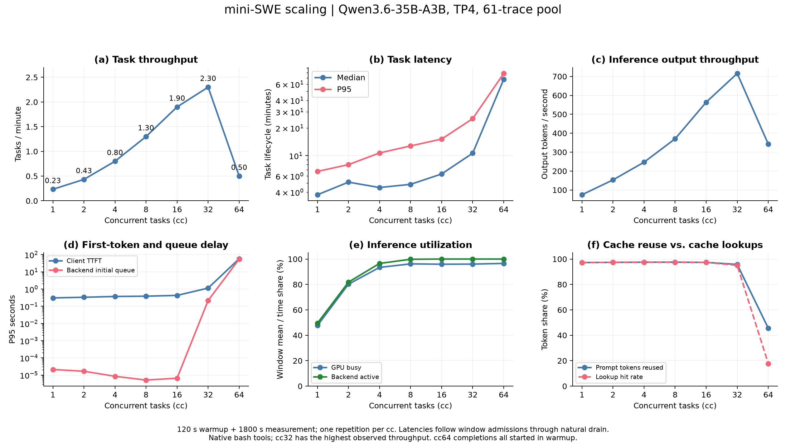
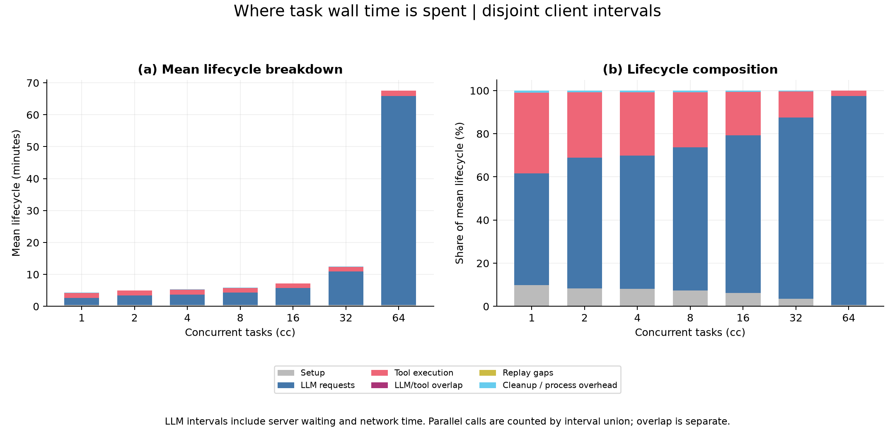
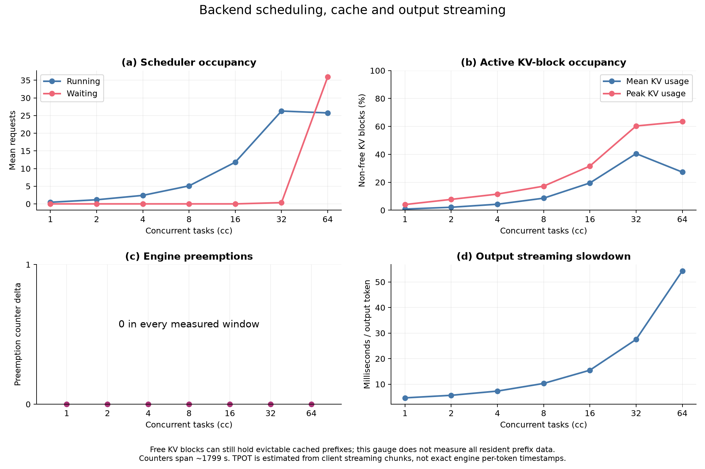
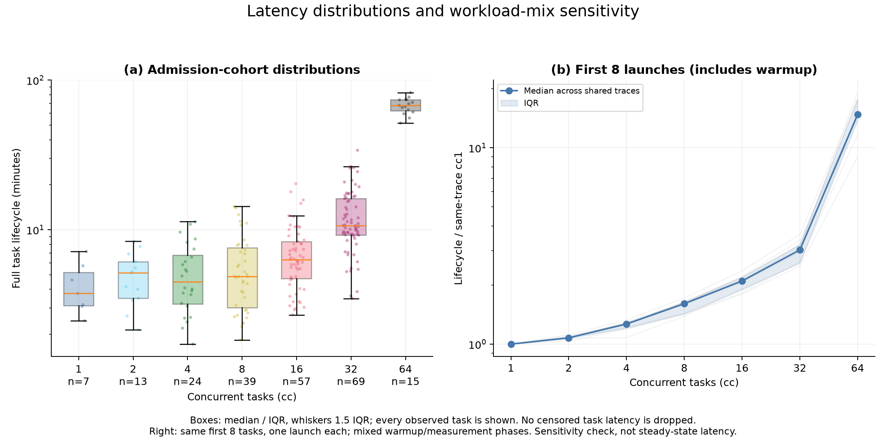
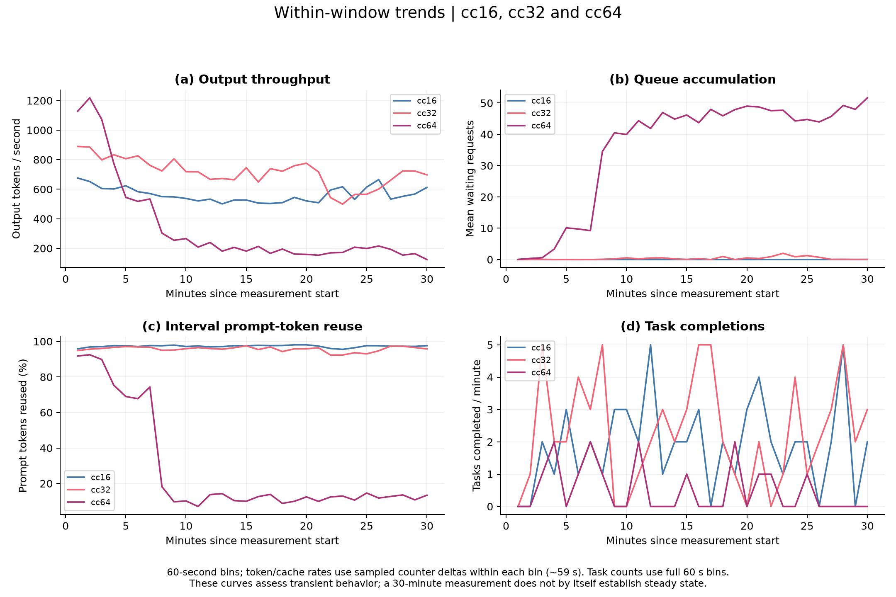
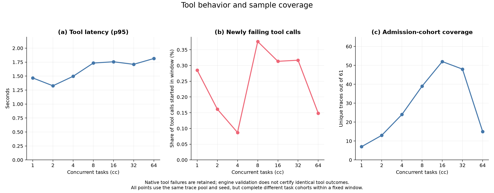
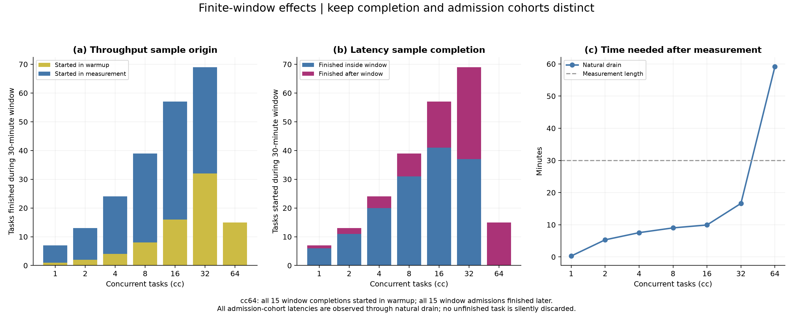

# mini-SWE 单推理节点 Scale 分析：Qwen3.6 TP4

**七档数据完整且计数一致。当前 sweep 的最高观测吞吐在 cc32；cc64 出现真实的后端退化，但 30 分钟窗口不足以给出稳态任务容量。**

[全部图表 PDF](minisweagent_scale.pdf) · [完整指标表](tables.md) · [汇总 CSV](summary.csv) · [校验记录](checks.json)

| cc | tasks/min | 输出 tokens/s | 任务 p95（分钟） | TTFT p95（秒） | 实际 prompt token 复用 |
|---:|---:|---:|---:|---:|---:|
| 1 | 0.23 | 74.7 | 6.74 | 0.31 | 97.2% |
| 2 | 0.43 | 153.3 | 7.99 | 0.33 | 97.4% |
| 4 | 0.80 | 246.8 | 10.71 | 0.37 | 97.5% |
| 8 | 1.30 | 370.4 | 12.77 | 0.39 | 97.5% |
| 16 | 1.90 | 563.8 | 15.17 | 0.43 | 97.4% |
| 32 | 2.30 | 715.9 | 25.30 | 1.14 | 95.8% |
| 64 | 0.50 | 342.4 | 78.66 | 57.71 | 45.6% |

## 性能趋势

- cc1→32：吞吐从 0.23 升至 2.30 tasks/min，约 9.86 倍；输出率同步升至 715.9 tokens/s。增益逐渐递减，延迟持续增长。cc32 是这七档中观测到的峰值，未验证为可持续容量或满足某个延迟 SLO 的最优点。
- cc32→64：任务吞吐下降 78.3%，输出率下降 52.2%。任务均值从 12.46 升至 67.57 分钟，p95 从 25.30 升至 78.66 分钟。两个吞吐指标都下降，不能只用窗口内完成任务组成变化来解释。
- 后端初始排队 p95 从 0.22 秒升至 55.15 秒，平均 waiting 从 0.35 升至 35.94 个请求；客户端 TTFT p95 从 1.14 升至 57.71 秒。平均 running 仅 26.28→25.75，增加的并发主要表现为等待。客户端和后端统计 cohort 不同，不将它们的 p95 相减或相加解释耗时。
- 同期平均任务生命周期增加量的 99.7% 来自 LLM 请求区间；工具 p95 仅 1.71→1.81 秒，setup 均值 26.71→27.23 秒。现有时间分解指向 LLM 路径的退化；这是墙钟时间归属，不能当作 GPU kernel 时间或独立的因果证明。
- 相同前 8 条任务的完整生命周期，相对各自 cc1 的延迟中位倍数在 cc16/32/64 为 2.10/3.02/14.78。同一批任务也明显变慢。但该辅助比较包含 warmup，不代表测量窗口内的配对稳态结果。

## 缓存与窗口内变化

- 实际 prompt token 复用：cc16/32/64 为 97.36%/95.76%/45.58%；查询命中率分别为 97.35%/95.05%/17.77%。cc64 查询 token / 实际处理 prompt token 达 8.40×，因此不能把查询口径的 17.8% 当作实际复用率。全部七档均以 source=local_compute/local_cache_hit 原始计数交叉核对，external transfer 为 0。
- cc32→64，本地 prefill 计算 token 计数率由 4434 升至 17475 tokens/s，约 3.94 倍；GPU busy 均值仍为 96.0%/96.6%。可确认输入计算 token 增多、输出产出降低，并非 GPU 已经不工作；仍不能仅凭这些计数确定缓存失效的唯一原因。
- KV 非空闲块占用均值由 40.5% 降至 27.3%，七档引擎抢占计数增量均为 0。KV gauge 不包括 free queue 中仍可复用、但可随时淘汰的历史前缀；总分配显存约 37.7 GiB/卡也不是活跃 KV 使用量。不能据此判定 OOM，也不能凭低 KV gauge 排除历史缓存淘汰。定义和 vLLM 0.19.1 源码依据见[缓存指标复核](../2026-09-08-openclaw-qwen36-scale/cache_interpretation.md)。
- cc64 前 10 分钟与最后 10 分钟：每分钟输出率均值约 661→175 tokens/s；平均 waiting 约 14.8→47.1；按 token 加权的复用比例约 73.4%→12.3%。全窗 45.6% 不能代表末段状态，后者的复用已经很低。分段计数采用各 60 秒 bin 内样本增量，边界约少 1 秒/bin。
- 与 OpenClaw 同配置 sweep 对照：OpenClaw 的最高观测吞吐在 cc16，mini-SWE 在 cc32，明显退化分别出现在更高档位。两类负载不能共用一个“最佳 cc”。这两次都是单轮结果；任务结构、实际覆盖和缓存历史不同，不能据此把差异单独归因于某个 trace 特征。

## 数据是否有问题

- **完整性与计数无异常。** 合计 351 次任务全部完成，报告节点集合与原 trace 对齐，每次 LLM call 的实际输出 token 数等于目标值；客户端、任务报告与后端总生成计数一致。七档 measurement valid，GPU 采样正常且无 error sample，admission cohort 无未完成样本。全部任务日志未发现 `Error building image`，本次有效点没有记录到 sandbox 构建失败重试。
- **正确选用补跑数据。** cc1/2/4/8 来自原 run；cc16/32/64 来自 recovery。排除原 run 中因 OCI 拉取失败而中止、没有完成 measurement 的 cc16。模型和 serve 配置、61 条 trace pool、seed、窗口及 replay 参数一致；唯一 profile 差异为 sandbox build 尝试上限 1→3，仅影响 setup，已记入配置和校验记录。
- **cc64 的完成数不代表已进入稳态。** 窗口内完成 15 条，全都在 warmup 启动；测量窗口中新启动 15 条，全都在窗口结束后完成。自然排空用了 59.14 分钟，超过 30 分钟测量窗。吞吐 0.50 tasks/min 是准确的该窗口完成率，但不足以断言长期容量只有 0.50。图 07 单独展示两类 cohort。
- **窗口内实际任务组成不同。** 七档 admission cohort 没有共同 trace；cc1 与 cc8 的 admission trace 集合也不相交。cc1 延迟只有 7 个样本，p95 很不稳定。任务延迟完整保留窗口后完成部分，没有做完成样本筛选；初始 8 条任务只用于辅助敏感性分析。
- **存在少量工具结果变化。** 窗口内原成功→重放失败为 [2, 2, 2, 14, 17, 22, 5] 次，占各档工具调用 0.087%–0.376%。大多数 native error 在采集时就已经是 error，例如非零退出的测试命令；不能把 native error 总数当成新增故障数。转换表也保留原失败→重放成功的情况。采集/回放错误标志一致不代表输出内容一致，当前 replay report 未保留足以逐条诊断的 native stderr；不能据此宣称 SWE 任务解题成功。
- **cc64 有额外 HTTP 探测流量。** 整个运行日志出现 1218 个 HTTP 404，其首条位于日志时间 09-08 15:40:38 与 09-08 15:40:48 之间，接近测量窗口末尾（结束时间 2026-09-08T15:41:39.861643+00:00）。日志包含与任务无关的扫描路径；之前各档无 404。全部 chat-completions POST 恰好对应已记录 LLM calls，且均返回 200。性能下降更早已经出现，因此这些探测不能解释退化起点；现有记录不能量化其对末段 API 延迟的影响，下一轮应隔离此类流量。详见 [HTTP 日志计数](http_log_checks.csv)。

## 测量口径与后续实验

- Qwen/Qwen3.6-35B-A3B，vLLM 0.19.1，BF16、TP4、4×A100 40GB；context=262144、max_num_seqs=64、max_num_batched_tokens=2048、GPU memory utilization=0.90、APC 与 thinking 开启。每点新启后端，预热 120 秒，测量 1800 秒，自然排空；seed=42。cc 包含 setup、replay、cleanup。bash 在原生 Singularity sandbox 中执行，工具 timeout=60 秒。
- 这是固定 trace 的性能重放：LLM 输出长度按录制 token 数控制，工具动作按 trace 执行，并不让新模型自由决定下一步。因此结果描述该负载的重放性能，不是 Qwen 重新解题的准确率或完整 agent 效果。
- tasks/min = 测量窗口内完成任务数 / 30 分钟；任务 latency = 测量窗口内启动任务的完整生命周期。LLM/tool latency 按窗口内启动的调用统计，后端 latency 按窗口内首次调度的请求统计，各 cohort 不必相同。
- 主图 output tokens/s 使用完整 1800 秒分母；active-output 和 decode throughput 使用不同活跃时间分母，仅列在指标表。时间堆叠使用互斥区间并集，LLM/tool 重叠单列，分项之和等于任务均值。
- actual prompt reuse = 同采样边界 Δcached prompt / Δprompt；cache lookup ratio = Δhits / Δqueries。新增计数器采用窗内首末样本差，跨度约 1799 秒。`prompt_tokens_recomputed_total` 在此版本主要记录完全缓存时强制计算末 token 的特殊情况，其为 0 不能排除缓存 miss 后重新计算历史输入。客户端 TPOT 来自流式 chunk 估算；scheduled→first token 是墙钟间隔，不是纯 prefill kernel 时间。
- 下一轮优先复核 cc32/64，并可在两者之间增加 cc48 定位退化区间。以请求队列、token 输出率和缓存复用的时间曲线判断是否稳定；cc64 任务生命周期已达一小时量级，应显著延长 warmup/measurement，或另做固定相同 trace 集合、全部完成的 batch 实验。后者报告 batch makespan/吞吐，不能混入本报告的固定窗口主图。
- 在转为论文中的容量结论前，需要独立重复，以及相同 trace 组成的对照。当前不把一轮中的任务当成独立实验重复来构造置信区间。工具结果变化应另外检查；无需因已录制的测试失败而将整档性能结果作废。

## 图表

### 01_scale_overview



[矢量 PDF](01_scale_overview.pdf)

### 02_latency_breakdown



[矢量 PDF](02_latency_breakdown.pdf)

### 03_backend_pressure



[矢量 PDF](03_backend_pressure.pdf)

### 04_latency_distributions



[矢量 PDF](04_latency_distributions.pdf)

### 05_window_trends



[矢量 PDF](05_window_trends.pdf)

### 06_tools_and_coverage



[矢量 PDF](06_tools_and_coverage.pdf)

### 07_measurement_cohorts



[矢量 PDF](07_measurement_cohorts.pdf)

## 数据与复现

- `summary.csv` / `tables.md`：七档指标；`tasks.csv`：351 次任务、cohort 标记及完整时间分解。
- `initial_eight_paired_latency.csv`：每档相同前 8 条任务的辅助比较，保留 admission phase。
- `tool_error_transitions.csv`：工具采集/回放错误标志的四种转换；`timeseries_60s.csv`：210 个分钟区间的后端与完成数趋势。
- `checks.json`：计数、source token 交叉核对与构建错误日志计数；`http_log_checks.csv`：服务日志 HTTP 状态检查。
- `run_config.json`：配置和输入选择；原始输入、工作区及大日志保留在本地，不包含在报告中。

```bash
.venv/bin/python reports/2026-09-13-minisweagent-qwen36-scale/analyze.py
```

输入基目录：`/lus/eagle/projects/lc-mpi/ZhijingYe/SIGMETRICS_2027/trace_framework/runs/scaling/qwen36-expanded-7594555-20260908`。具体七档路径见 `run_config.json` 的 `analysis_provenance.points`。脚本只读取既有数据，不调用推理后端或重放工具。
