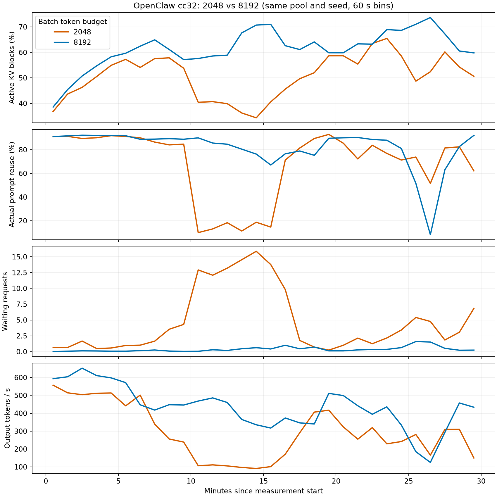

# OpenClaw cc32：2048 / 8192 token budget 对照

**8192 显著缓解了这轮 cc32 的 KV 活跃占用下跌和调度排队，输出吞吐提高 46.9%；前缀复用损失仍然存在，不能称为彻底解决所有高并发 cache drop。**

两组均正常完成，客户端、后端事件和 vLLM 输出计数校验通过。使用相同两个节点、110 条 trace pool、seed 42、cc32、TP4、context 262144、120 秒 warmup 和 1800 秒 measurement，各自从新后端开始。两组均启用相同 scheduler diagnostics；配置对比确认只有 batch token budget 不同。最初工具冷启动不一致的 `openclaw-budget2048` 未完成段不纳入本次比较。

| 指标 | 2048 | 8192 |
|---|---:|---:|
| 输出 tokens/s（完整测量窗口） | 294.7 | 433.0 |
| 窗口内完成任务 | 141 | 202 |
| 平均 KV 活跃块占用 | 50.6% | 61.4% |
| KV 使用率低于 40% 的采样占比 | 19.3% | 2.3% |
| 实际 prompt token 复用率 | 81.7% | 85.6% |
| Prefix lookup hit ratio | 62.1% | 81.7% |
| 平均 running / waiting requests | 25.27 / 4.74 | 28.77 / 0.37 |
| 初始排队 p95 | 38.78 s | 1.23 s |
| 客户端 TTFT p95 | 41.50 s | 3.42 s |
| 已完成 admission cohort 的 setup p50 | 10.91 s | 11.06 s |
| 实际 KV block 数量 | 3630 | 3543 |
| 等待请求因对齐得到零 token 配额 | 7085 次 | 822 次 |
| 上述次数 / 调度步数 | 34.95% | 3.00% |
| full-ISL 拒绝 / 分配失败 / running-limit 步数 | 0 / 0 / 0 | 0 / 0 / 0 |
| preemption | 0 | 0 |

## 下跌是否缓解

2048 的测量第 10–15 分钟出现明显低谷：平均 KV 使用率 38.3%，实际 prompt 复用率 14.5%，running 17.8、waiting 13.7。8192 在同一相对时间段分别为 62.7%、83.8%、29.3 和 0.32；图中持续性的 KV 低谷和等待堆积显著缓解。两组都是闭环负载，速度不同会使此时执行的 trace 位置不同，不能把该时间段当作逐请求配对实验。

**8192 并没有消除 cache miss 与吞吐低谷：第 26–27 分钟实际 prompt 复用率仍跌到 8.16%，输出吞吐约 125 tokens/s，而此时 KV 活跃占用为 73.67%、running 为 29.55、waiting 为 1.52。** 该分钟本地 prefill 计算量约 20,982 tokens/s。这说明高 KV 活跃占用不等于历史前缀能命中，也不能用“KV gauge 不再大跌”宣称 cache drop 已根治。

8192 仍有短暂低点（单次 KV 采样最低 28.9%），且全窗口实际 prompt 复用率 85.6%，没有恢复到此前 OpenClaw cc16 的 93.8%。它缓解了本次观察中很大一部分调度阻塞，缓存匹配损失仍需另行解释。

## 调度日志支持什么机制

这次日志直接记录了 waiting 请求在原生 Mamba 对齐函数中由正 token allowance 被缩减为 0 的分支。模型 block size 为 528；2048 组的一个例子中，剩余 token allowance 为 441，尚有 2568 个 free blocks，但请求无法在该调度步进入运行。此类事件在 8192 中大幅减少，与 running 增多、waiting 减少及 KV 活跃占用恢复一致。

本次两组都没有记录 full-ISL gate 拒绝、slot allocation 失败、达到 running 上限或 preemption。日志支持“小预算下的对齐限制是本轮排队的重要因素”，但不应把调度事件次数解释为 GPU 时间比例或互斥等待原因。

8192 的 KV blocks 反而少了 2.4%，说明改善并不是来自更大的缓存池。两组最后一次 admission 查询中，仍分别有 303 和 410 个请求至少一次出现 Mamba lookup 缩短候选长度；两组 admission 总数不同，原始次数不能直接比较 miss 率。这只说明 hybrid state 匹配限制仍存在，不能判断 checkpoint 缺失究竟来自淘汰还是其他保留机制。

## 对下一步实验的意义

这轮支持优先验证 8192 作为后续吞吐实验配置，但仍只有 OpenClaw cc32 的单次 A/B；OpenClaw cc64、mini-SWE cc64 的对应结果尚不存在。它还不足以证明所有并发档都消除了 drop，或已确定最优单节点 capacity。若更换预算，多节点 N=1 基线及各 N 必须统一使用同一预算，不能直接把旧 2048 的曲线接入新配置。

后续配置决定（2026-09-14）：按用户要求，默认模板和待提交的多节点配置已统一改为 8192，单副本并发保持 OpenClaw 16、mini-SWE 32。未提交新任务；本报告的原始对照数据保持不变。

## 统计口径与文件

- [summary.csv](summary.csv)：对照表；[timeseries_60s.csv](timeseries_60s.csv)：每分钟曲线；[diagnostics.json](diagnostics.json)：原始计数、配置及阻塞例子；[PDF](budget_comparison.pdf)。
- 实际复用为窗口内原始 Prometheus cached/prompt counter 增量之比；lookup hit ratio 是 hits/queries，重复查找会影响其分母，不能替代实际 token 复用率。
- KV/running/waiting 为约 1 秒采样的统计量；低于 40% 的比例是描述性采样占比，不是有效性门槛。每组 counter 首末采样覆盖约 1799.7 秒，输出吞吐以完整 1800 秒计算。
- 排队/prefill latency cohort 为窗口内首次调度的请求，跟踪至自然完成；scheduler interval 按落入窗口的记录时间计数，边界有约一秒的采样误差。
- 原始数据：`runs/scaling/baseline-validation-7608115-20260913/openclaw-warmed-budget{2048,8192}/openclaw-cc32/`。
- 复现：在 repo 根目录运行 `.venv/bin/python reports/2026-09-14-token-budget-comparison/analyze.py`。仅读取已有结果，不调用模型或工具 API。
