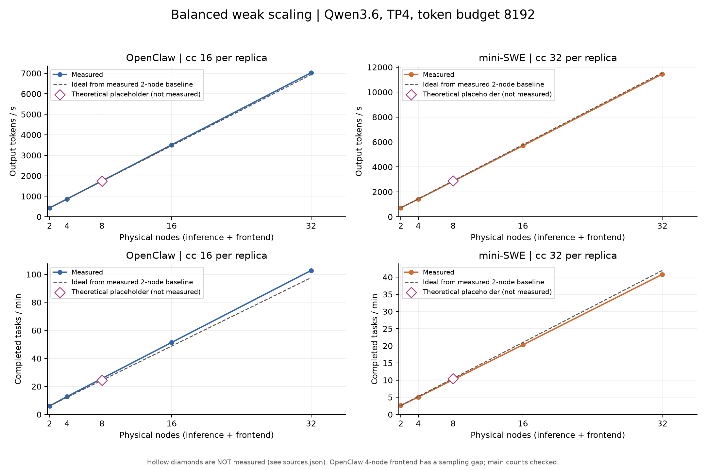

# Balanced weak scaling：OpenClaw 与 mini-SWE

数据提取时间：2026-09-15T14:35:17.742509+00:00。

**当前实测结果支持：在本次 balanced 布局和固定每副本并发下，两类任务扩到 32 个物理节点，token 吞吐仍接近线性增长，没有出现此前单节点高并发时的持续吞吐塌陷。** 每个规模只有一次运行，不把略高于 100% 的效率解读为超线性加速，也不据此宣称已找到最大容量。

**理论占位：OpenClaw 8 物理节点、mini-SWE 8 物理节点，尚无实测数据。** 按同 workload 的 2 物理节点实测基线乘以推理副本数计算 token/task 吞吐。吞吐图用空心菱形区分；CSV/JSON 标记 `source_kind=theoretical`，原始 run 路径为空。没有估造延迟、cache、资源、错误率、任务计数或时间序列；占位值不参与下面的实测结论。

## 核心结果

| Workload | 物理节点 | 输出 tokens/s | 任务/min | Token speedup | Token 效率 | Task 效率 |
| --- | --- | --- | --- | --- | --- | --- |
| OpenClaw | 32 | 7027.79 | 102.78 | 16.209× | 101.30% | 105.31% |
| mini-SWE | 32 | 11446.85 | 40.82 | 15.851× | 99.07% | 97.30% |

效率 = 本档吞吐 /（同配置 2 物理节点基线吞吐 × 推理副本数）；基线已使用本轮新完成的 8192 长窗口结果，未混用旧 2048 短窗口数据。完整各档数据见 [指标表](tables.md) 和 [summary.csv](summary.csv)。



- **OpenClaw**：最大规模每推理副本 439.24 tokens/s，基线 433.58；复用率 93.95% → 93.96%；TTFT p95 1.032 → 0.996 秒；任务 p95 522.1 → 481.8 秒。各档半窗口 token 吞吐变化最大 2.67%，副本吞吐 CV 最大 0.91%。
- **mini-SWE**：最大规模每推理副本 715.43 tokens/s，基线 722.14；复用率 95.62% → 95.59%；TTFT p95 0.707 → 0.770 秒；任务 p95 1615.1 → 1695.3 秒。各档半窗口 token 吞吐变化最大 2.12%，副本吞吐 CV 最大 1.56%。

任务吞吐与 token 吞吐的效率并不完全相同：不同运行窗口中的任务组成、完成边界和原生工具执行结果会影响 tasks/min。不能用接近线性的 token 吞吐推断任务延迟完全不变。

## 配置和统计口径

- 横轴均为**物理节点数 2/4/8/16/32**，分别对应 1/2/4/8/16 个推理副本，加相同数量 frontend。不是 2/4/8/16/32 个推理副本。
- Qwen3.6-35B-A3B；每推理节点 TP4、4 GPU；context 262144；max_num_seqs 64；max_num_batched_tokens 8192；GPU memory utilization 0.90；prefix caching 和 thinking 开启。
- OpenClaw：每副本 cc16，110 条 trace，warmup 600 秒、measurement 3600 秒。
- mini-SWE：每副本 cc32，61 条 trace，warmup 1800 秒、measurement 5400 秒。各 frontend 均完成全部 61 个共享 SIF 到本地缓存的准备/复用检查。
- 同 workload 各档的 serve、完整 trace 路径列表、replay profile、seed 规则、warmup/measurement 与基线一致。每副本使用相同 trace pool、seed 随副本变化并循环重放；sticky 路由到对应后端，prefix cache 在各后端本地。该实验评估成比例增加 frontend 和独立推理副本的扩展性，不是单请求跨节点加速或全局共享 KV cache。
- Token 吞吐为共同测量窗口内产生的增量输出 token / 窗口秒数；task 吞吐为窗口内完成的重放数 / 时间。任务延迟使用窗口内接纳、允许自然 drain 完成的 cohort；TTFT、工具错误率按窗口内开始的调用计数。
- Prompt 复用率 = cached prompt tokens / prompt tokens，按窗口内首 token 请求加权；与 KV cache 使用率、GPU 显存占用不同。硬件和后端 gauge 指标先对节点内样本求均值、再对相同角色节点求均值。能耗只统计推理 GPU，未包含 frontend 或整机功耗。

## 数据完整性与限制

本次核对 8 个实测点：任务和调用均完整结束、目标输出 token 与实际输出一致，全程 LLM 请求/token 数与后端计数一致，测量窗口计数与时间序列一致；各档时间稳定性子检查均通过。检查详情和保留的原始状态在 [analysis.json](analysis.json) 的 `audits` 中。

OpenClaw **4 物理节点**是保留的例外：旧 runner 因一个 frontend 的一次 5.59 秒采样间隔将整档标成 `valid=false/steady=false`。此次确认没有失败采样、计数缺失或后端 counter reset，主吞吐可用；原始标记和错误文本保持不变，该 frontend 的资源均值存在采样缺口。其他选定实测点原始 valid/steady 均为 true。

原生工具执行不保证与录制结果逐条相同。下表将全部 native errors 与相对录制新增的错误分开；后者会影响工具耗时和端到端吞吐的解释。这里的“任务完成”指 trace 重放结束，不代表 SWE 题目修复成功。

| Workload | 物理节点 | 测量期 tool calls | Native errors | 原成功→重放错误 | 新增错误率 | 原错误→重放成功 |
| --- | --- | --- | --- | --- | --- | --- |
| OpenClaw | 2 | 5080 | 375 | 41 | 0.807% | 20 |
| OpenClaw | 4 | 10367 | 737 | 38 | 0.367% | 45 |
| OpenClaw | 16 | 41754 | 3273 | 397 | 0.951% | 183 |
| OpenClaw | 32 | 83671 | 6776 | 1026 | 1.226% | 341 |
| mini-SWE | 2 | 20937 | 2211 | 56 | 0.267% | 224 |
| mini-SWE | 4 | 41393 | 4385 | 118 | 0.285% | 452 |
| mini-SWE | 16 | 165464 | 17421 | 470 | 0.284% | 1884 |
| mini-SWE | 32 | 332283 | 35266 | 1021 | 0.307% | 3731 |

高 cache 复用是在固定 trace pool、循环重放和充分 warmup 下得到的；结果不能直接外推到不断出现的新任务或冷 cache 工作负载。副本差异、分钟波动均不是独立重复实验的置信区间。

## 图表

- [吞吐](01_throughput.png)：两种 workload 的 token/task 吞吐、理论参考线和明确标记的占位值。
- [效率与副本均衡](02_efficiency_and_balance.png)：实测扩展效率及每副本吞吐散点。
- [延迟与 cache](03_latency_and_cache.png)：TTFT、任务 p95、prompt 复用和 KV 使用率。
- [资源与队列](04_resources.png)：GPU busy、frontend CPU、waiting 和推理 GPU 单 token 能耗。
- [执行时间与工具错误](05_execution_and_tool_errors.png)：平均任务时间的堆叠柱图，以及原生/新增工具错误率。
- [时间稳定性](06_time_stability.png)：每分钟、每副本输出吞吐与 cache 复用曲线。
- [完整 PDF](weak_scaling.pdf)：六页图表；每张图也提供单独 PDF。

## 重现和替换占位

已提交 [analysis.json](analysis.json)、[summary.csv](summary.csv)、[replicas.csv](replicas.csv)、[timeseries.csv](timeseries.csv)，可在没有原始 runs 的机器上重画：

```bash
python -m pip install -r reports/requirements.txt
python reports/2026-09-15-weak-scaling/analyze.py --plots-only
```

8 物理节点实测结果出来后，把 [sources.json](sources.json) 中对应 workload 的键 `"4"`（4 个推理副本）从 `null` 改成新的原始 run 相对仓库路径，再在保存原始数据的机器运行：

```bash
.venv/bin/python reports/2026-09-15-weak-scaling/analyze.py
```

脚本重新核对实测计数、替换理论值，并生成全部表格、图和本 README。只读原始结果，不提交作业、不修改原始 run。GitHub 上保留的是派生指标和图表，没有上传体积很大的调用明细或运行日志。
