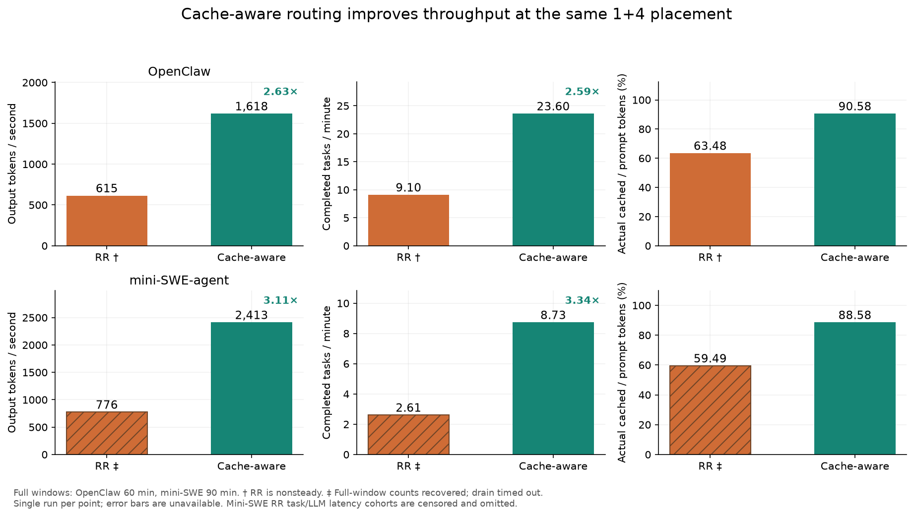
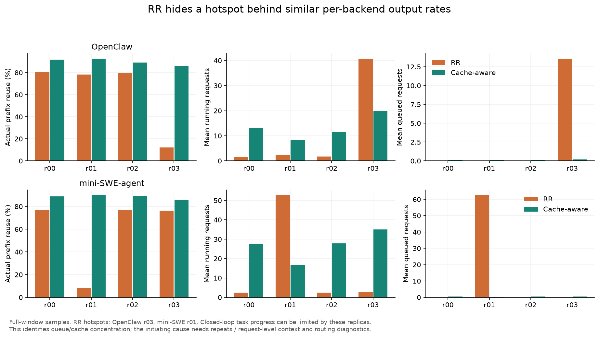
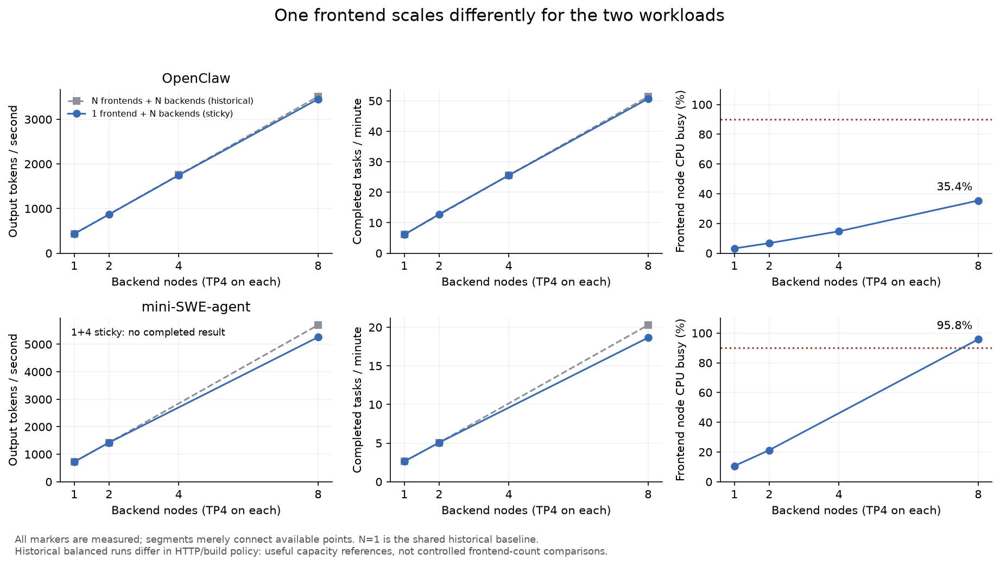
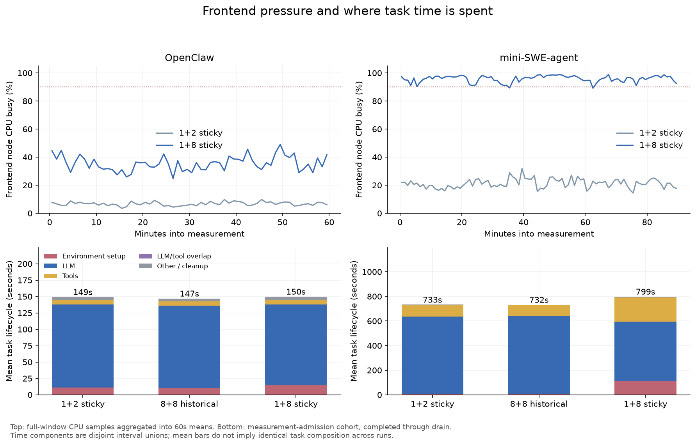

# Routing 与固定前端扩展：完整窗口结果

**合并更新见 [09-22 报告](../2026-09-22-routing-and-frontend/README.md)**：新增 mini-SWE 两项前端对照和 OpenClaw 1+8 RR，已更新对比图、创建/工具耗时及热点分析；P2 暂不纳入。以下保留 09-21 历史快照，其待验证判断和后续实验列表以新报告为准。

2026-09-21。本批 4 个 PBS allocation、6 个实验点：**5 点完整完成，mini-SWE RR 在 drain 超时**。主要结果是：cache-aware 相比 RR 的输出吞吐提高 2.63× / 3.11×；RR 出现单后端排队热点；mini-SWE 在 1 前端 + 8 后端已接近前端供给上限，OpenClaw 在同一配比仍有余量。

[全部图表 PDF](results.pdf) · [汇总 CSV](summary.csv) · [完整分析 JSON](analysis.json) · [原始运行索引](sources.json)

请求级补查见 [RR 热点原因与负载反馈](rr-hotspot.md)：RR 确实均分了请求数，热点主要体现为请求滞留差异；官方 cache-aware 同时有前缀亲和与负载反馈，不能把全部增益归为前缀亲和。

## 1. 数据是否能用

`F+B` 表示前端节点数 + 推理后端节点数，每个后端 TP4。下表均为实测，不包含理论补点。

| 实验 | PBS Job | 数据状态 | 窗口完成任务 | 输出 tokens/s | tasks/min | 实际前缀复用 | 前端 CPU 均值 |
|---|---|---|---:|---:|---:|---:|---:|
| OpenClaw 1+4 RR | 7642785 | 完整；非稳态 | 546 | 614.59 | 9.10 | 63.48% | 4.96% |
| OpenClaw 1+4 cache-aware | 7642785 | 完整；稳态 | 1,416 | 1,618.49 | 23.60 | 90.58% | 13.60% |
| mini-SWE 1+4 RR | 7642786 | **仅完整测量窗口可恢复** | 235 | 775.60 | 2.61 | 59.49% | 11.83% |
| mini-SWE 1+4 cache-aware | 7642786 | 完整；稳态 | 786 | 2,412.67 | 8.73 | 88.58% | 38.42% |
| OpenClaw 1+8 sticky | 7642787 | 完整；稳态 | 3,044 | 3,453.22 | 50.73 | 93.98% | 35.43% |
| mini-SWE 1+8 sticky | 7642788 | 完整；稳态 | 1,679 | 5,259.45 | 18.66 | 96.64% | 95.79% |

五个完整点的 worker、任务、LLM 调用/后端请求、输出 token、目标输出长度、工具错误计数对账均通过，任务失败数为 0。检查明细见 [completed_call_audit.json](completed_call_audit.json)。原始 `valid` 与 `steady` 分开保留；“完整”不代表已经获得稳定容量或跨运行统计置信度。

mini-SWE RR 的 90 分钟测量已跑满，停止接纳后等待 30 分钟仍有 **36 个任务未结束**，coordinator 的 drain 等待超时并取消这些任务。它的原始状态仍是失败，没有修改成成功，也没有补写原始 summary。窗口内接纳 235 个任务，其中 199 个最终完成、36 个被取消；窗口内完成的 235 个任务包含此前 warmup 接纳的任务，二者不是同一个 cohort。

恢复出的 4,188,219 个窗口输出 token，逐请求与后端完成记录对账无缺失、无 token 数不一致；首 token 在窗口内的请求均正常达到长度上限。四个后端指标覆盖完整窗口，无计数器重置，最大采样间隔 1.13 秒。事件计数和 Prometheus 边界增量的逐后端差异最大约 0.016%，符合约 1 秒边界偏移。故可用于**固定 90 分钟窗口的吞吐、复用与排队分析**；不能用被截断的任务集合计算完整任务 p95，也不报告它的完整客户端 LLM 延迟 cohort。恢复细节在 `analysis.json` 的 `recovery_audit`。

OpenClaw RR 虽完整结束，但后半段输出从 675.18 降至 554.00 tokens/s（−17.95%），完成任务从 314 降至 232，平均每后端排队从 2.39 增至 4.45。因此 614.59 是该窗口平均值，不能作为稳态容量。mini-SWE RR 前后半段输出为 799.85 / 751.34 tokens/s；其 raw steady 缺失，本报告未把失败点重新认定为稳态。

## 2. Routing：收益很大，且有明确的热点现象



两种策略的模型、后端数、前端数、trace pool、每副本 cc、seed、warmup/measurement、HTTP/replay policy、官方 router 参数均匹配，仅路由策略不同。各点使用独立物理节点；仍是每点单次运行。

| 指标：RR → cache-aware | OpenClaw | mini-SWE |
|---|---:|---:|
| 输出吞吐倍率 | **2.63×** | **3.11×** |
| 完成任务吞吐倍率 | 2.59× | 3.34× |
| 实际前缀复用 | 63.48% → 90.58% | 59.49% → 88.58% |
| 每输出 token 对应的未复用输入 | 60.28 → 15.86 | 63.31 → 17.66 |
| 相邻调用切换后端比例 | 73.91% → 17.18% | 74.64% → 16.11% |
| 逐后端输出吞吐 CV | 5.75% → 11.49% | 2.54% → 5.33% |
| 客户端 TTFT p95 | 43.52 s → 1.95 s | RR cohort 不完整；CA 为 2.30 s |
| 任务 lifecycle p95 | 1,505.20 s → 558.43 s | RR cohort 不完整；CA 为 1,916.02 s |

相邻调用统计只取窗口内至少 8 次已完成调用的 task，按相邻调用对加权。Cache-aware 仍会迁移任务：平均每个入选任务访问 OpenClaw 2.47、mini-SWE 3.52 个后端，不能称作严格 task-sticky。

**输出均匀不等于服务压力均匀。** 下图使用完整窗口的逐后端采样：



| RR 后端 | 实际前缀复用 | 平均 running 请求 | 平均 waiting 请求 |
|---|---:|---:|---:|
| OpenClaw r00 / r01 / r02 | 80.72% / 78.15% / 79.78% | 1.61 / 2.26 / 1.78 | 0.039 / 0.028 / 0.027 |
| **OpenClaw r03** | **12.26%** | **40.74** | **13.58** |
| mini-SWE r00 / r02 / r03 | 76.96% / 76.65% / 76.37% | 2.39 / 2.38 / 2.62 | 0.015 / 0.016 / 0.016 |
| **mini-SWE r01** | **8.20%** | **52.74** | **62.56** |

RR 的排队几乎都集中在一个后端。其他后端只有约 2 个 running 请求，却有相近的窗口输出量。Cache-aware 下，OpenClaw 四个后端 waiting 均值为 0.09–0.19，mini-SWE 为 0.33–0.60。mini-SWE RR 热点 r01 的窗口内还记录到 11 次 preemption，其余三个为 0。

这些结果支持的机制是：路由改变连续调用的局部性，影响未复用输入工作量；某个副本进入低复用、长排队状态后，串行依赖的 agent 任务在那里等待，其他后端也得不到足够后续请求，形成闭环反馈。**单热点及其队列是直接观测，热点最初为何形成尚未证明**：还需逐请求 context/uncached tokens/prefill 与时间顺序分析，及重复运行排除节点、初始顺序与调度相位的影响。当前结果不能直接认定为 vLLM 或 router 的实现 bug，也不能把全部收益归为单一缓存机制。

更多图：[吞吐/复用/排队时间序列](figures/02_routing_timeseries.png)、[局部性与未缓存输入](figures/03_routing_locality.png)、[OpenClaw 延迟](figures/07_openclaw_routing_latency.png)。逐后端完整采样汇总见 [replica_diagnostics.csv](replica_diagnostics.csv)。

## 3. 固定前端：OpenClaw 可继续扩，mini-SWE 已接近供给上限



| Workload | 部署 | tokens/s | tasks/min | 前端 CPU 均值 |
|---|---|---:|---:|---:|
| OpenClaw | 1+1 历史基线 | 433.58 | 6.10 | 3.20% |
| OpenClaw | 1+2 sticky | 868.97 | 12.78 | 6.77% |
| OpenClaw | 1+4 sticky | 1,747.21 | 25.57 | 14.72% |
| OpenClaw | 1+8 sticky | 3,453.22 | 50.73 | 35.43% |
| OpenClaw | 8+8 历史参考 | 3,510.69 | 51.42 | 3.34% / frontend |
| mini-SWE | 1+1 历史基线 | 722.14 | 2.62 | 10.61% |
| mini-SWE | 1+2 sticky | 1,425.35 | 5.07 | 21.24% |
| mini-SWE | 1+4 sticky | **缺有效结果** | — | — |
| mini-SWE | 1+8 sticky | 5,259.45 | 18.66 | 95.79% |
| mini-SWE | 8+8 历史参考 | 5,699.78 | 20.29 | 10.77% / frontend |

OpenClaw 1+8 保留了历史 8+8 的 **98.36% token 吞吐、98.67% task 吞吐**。mini-SWE 相应为 **92.27% / 91.95%**。使用节点由 16 降至 9，减少 43.75%；本次 prod 实际申请了 10 个节点，其中 1 个闲置，调度分配节点数的减少为 37.5%，不能把 9 个使用节点等同于本次付出的全部 allocation。

历史 balanced 使用旧 HTTP/build policy，因此这些百分比是部署趋势参考，不能当作只改变前端数的严格因果 A/B。当前正式 fixed-frontend 点使用相同的新 HTTP policy。OpenClaw balanced N=4 使用已经完成的实测值，mini-SWE 缺失点保持缺失，没有沿用旧报告的理论占位。

mini-SWE 的具体瓶颈证据：

- 90 个一分钟窗口中 **88 个 CPU 均值 ≥90%**；全窗口 CPU 均值 95.79%，p95 99.58%，64 个逻辑 CPU 上平均约 124 个 runnable processes。
- 内存至少仍有 452.6 GiB 可用，本地 scratch 至少 1,972.4 GiB 空闲；iowait 均值仅 0.119%。没有本轮内存/磁盘容量耗尽的证据。
- 实际前缀复用为 96.64%，高于历史 8+8 的 95.45%。当前吞吐损失不呈现之前那种 cache-hit 崩落。
- 1,679 个 measurement admissions 均有 setup 记录。等待 4 个环境创建名额：均值 **97.29 s**，p50 50.07 s，p95 **350.27 s**；实际 build 均值 **12.72 s**、p95 18.96 s。
- 按 `4 × 60 / 12.72` 粗算创建供给约 **18.87 tasks/min**，接近实测 **18.66 tasks/min**。这是基于 admission cohort 的近似容量估计，部分 setup 跨窗口，不是精确服务上界。
- 前/后 45 分钟 admission cohort 的创建等待均值从 **65.61 s 增至 129.15 s**。原始 steady 检查看吞吐和后端队列，不涵盖此前端等待增长；不能仅凭 `steady=true` 认定所有延迟已稳定。



| mini-SWE 每任务平均生命周期组成 | 历史 8+8 | 当前 1+8 |
|---|---:|---:|
| 环境准备（含等待） | 4.50 s | **110.65 s** |
| LLM 执行 | 636.29 s | 485.18 s |
| 工具执行 | 88.98 s | **194.72 s** |
| 其他/清理 | 2.59 s | 8.00 s |
| 总计 | 732.36 s | 798.55 s |

这是“前端 CPU 竞争 + 环境创建限流共同制约请求供给”的证据。CPU 竞争使 build/tools 变慢，build 名额等待又占据总 task 并发，后端同时获得的请求减少。现有数据还不能分离 CPU 与创建名额各贡献多少。1+8 只能说明已经进入受限区域，尚不足以确定精确拐点或最大容量；1+4 sticky 仍应补齐。

[环境构建分布图](figures/06_sandbox_setup.png) 使用箱线图（p25–p75，须 p5–p95，均值菱形），没有统一改成 CDF。

## 4. 工具错误与可比性

任务成功完成不等于每次 native tool 返回都成功。这里按录制 trace 的 `isError` 与 replay 的 `native_error` 对照，区分原本就报错的命令与录制成功、回放报错的调用。

| 完整点 | 窗口工具调用 | native error | 其中录制成功→回放 error | 占全部工具调用 |
|---|---:|---:|---:|---:|
| OpenClaw RR | 7,349 | 601 | 73 | 0.99% |
| OpenClaw cache-aware | 19,205 | 1,535 | 198 | 1.03% |
| OpenClaw 1+8 sticky | 40,922 | 3,204 | 405 | 0.99% |
| mini-SWE cache-aware | 69,971 | 7,465 | 197 | 0.28% |
| mini-SWE 1+8 sticky | 152,233 | 16,842 | 1,194 | **0.78%** |

mini-SWE 历史 8+8 的相应新增错误比例为 470/165,464 = 0.28%。1+8 的增加值得在前端对照中继续核查错误内容与超时比例，不能直接用任务失败数 0 宣称工具行为完全一致，也不能仅凭比例把新增错误全归为 CPU。不同闭环运行的任务组成并非逐请求配对。

测量口径：OpenClaw warmup 600 s、measurement 3600 s、每副本 cc16、110 条 trace；mini-SWE 为 1800 s、5400 s、cc32、61 条 trace。模型 Qwen3.6-35B-A3B，TP4，context 262144，batch token budget 8192，max sequences 64，APC/thinking 开启。RR/cache-aware 均走官方 vllm-router 0.1.15 及同一协议适配路径。`web_search` 使用录制 delay，其余配置指定的工具照常 native replay。

输出吞吐按 `[measurement_start, measurement_end)` 内 token 事件统计；任务吞吐按窗口内完成任务统计；复用按首 token 落入窗口的请求汇总 cached/prompt，不能平均各后端命中率。完整点的任务延迟按窗口 admission cohort、LLM 延迟按窗口 node-start cohort，允许自然 drain。每条曲线覆盖各自相同长度的完整窗口，并非六个点同一绝对起止时间。

所有点均为单次运行，无跨 run 置信区间。Trace pool 循环回放，后续 prompt 仍来自原始录制；结果不直接代表不断到达的新任务、真实生成反馈或 SWE-bench 解题正确率。KV usage 是 vLLM 报告的 gauge，不能替代实际复用率或推导所有 hybrid cache group 的剩余容量。

## 5. 下一步建议：先做能区分机制的点

| 优先级 | 实验/分析 | 要回答的问题 | 控制条件与主要观测 |
|---|---|---|---|
| 1 | 补 mini-SWE **1+4 sticky** | 1+2 到 1+8 的拐点在哪里 | 沿用已有 workload、cc32/backend、4 个 build 名额；已有保留任务先核对，避免重复提交 |
| 1 | mini-SWE **2+8，合计 4 个 build 名额** | 增加 CPU 是否能降低 build/tool 时间、恢复后端供给 | 与 1+8 比较；每前端 2 个名额，固定总 cc256、sticky、总名额；记录 CPU、setup 等待、工具耗时/错误、backend running 与吞吐 |
| 1 | mini-SWE **1+8，build 名额 4→8** | 创建限流贡献多大；提高名额是否反而加剧 CPU 竞争 | 前端数、后端数、总 cc 与 replay policy 不变；不能把 2+8 和放宽名额同时改变后的收益全归给 CPU |
| 1 | OpenClaw **1+16 sticky** | 35% CPU 的 1+8 再扩一倍后是否仍近线性 | 沿用当前配置；1+16 此前失败的运行不是有效结果；重点看 CPU、setup/tools 与后端请求供给 |
| 2 | RR 原始请求级时序分析 + RR/cache-aware 成对重复 | RR 热点是稳定机制还是节点/初始次序敏感现象 | 先分析现有 prompt 长度、未缓存输入、prefill、排队、抢占的先后；重复时保持配对 seed/配置，明确物理节点与副本编号映射 |
| 2 | mini-SWE RR 的完整 drain 重复 | 获取无删失的任务尾延迟 | 保持 90 min measurement，重新规划更长 drain **及对应总 walltime**；单纯扩大 drain 仍塞进 3h allocation 不可靠；原窗口吞吐不需要因此作废 |
| 3 | 同一路由路径的前缀复用消融 | 路由收益有多少来自缓存、多少来自负载反馈 | 在 RR/cache-aware 间保持协议和其余配置相同，确认禁复用干预确实生效，再比较差距；不把当前 sticky 直连当作完全匹配的 router 对照 |

建议先把前端配比的两个 mini-SWE 控制实验和 OpenClaw 1+16 排上，再对支撑主要结论的点做至少两次额外独立重复。大规模 routing 扩展应在 RR 单热点的可重复性明确后安排。以上是待讨论方案，本轮只做数据分析。

## 6. 文件与复现

- `analysis.json`：17 个实测新/历史点，含失败窗口恢复审计、CPU/setup/routing 统计、完整性与非稳态标记。
- `summary.csv`、`timeseries.csv`、`replicas.csv`：主表、60 s 时间序列、逐后端吞吐/复用。
- `sandbox_setup.csv`：measurement admission cohort 的逐任务创建等待和 build 数据。
- `completed_call_audit.json`：5 个完整点的调用/token/tool 错误对账；复用已有 weak-scaling 审计实现。
- `replica_diagnostics.csv`、`replica_timeseries.csv`：4 个 routing 点逐后端完整采样统计与 60 s 时间序列。
- `figures/`：8 张 PNG 和对应矢量 PDF；`results.pdf` 合并全部图。

在仓库根目录运行：

```bash
.venv/bin/python reports/2026-09-21-routing-and-fixed-frontend/analyze.py
.venv/bin/python reports/2026-09-21-routing-and-fixed-frontend/audit_completed.py
.venv/bin/python reports/2026-09-21-routing-and-fixed-frontend/replica_diagnostics.py
.venv/bin/python reports/2026-09-21-routing-and-fixed-frontend/analyze.py --plots-only
```

第一次提取会只读原始运行日志；之后仅调图可用最后一条命令。原始数据与原始失败状态均保留。本报告替代 [前 45 分钟中途分析](../2026-09-21-cross-layer-insights/README.md) 中本批运行的暂定数值。
