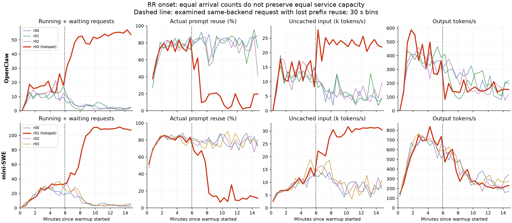

# RR 热点归因：同一后端的前缀复用损失，以及没有负载反馈的放大过程

2026-09-21。仅离线分析既有 RR 运行，没有启动推理、提交任务或修改实验配置。

**目前最有证据支持的解释是：本地前缀缓存可用性损失增加 prefill 工作，处理能力随缓存和在途负载变化；RR 继续均分新请求，使这个差异发展成持续积压。** 不能只说“请求成本不同”或“慢后端积压”，也不能把整个现象归为 RR 普遍存在的缺陷。此次补查定位了退化转折附近的具体请求和复用损失；尚不能证明某一个请求是唯一触发器，或给缓存损失指定一个已经确认的底层 bug。

## 1. 最直接的新证据：没有换后端，已有公共前缀仍不能复用

从后端完成事件与 middleware ledger 匹配请求，再用本地同一 tokenizer/chat template 重建两对相邻输入。四个请求的重建 token 数全部与实际后端计数一致。

| 指标 | OpenClaw / r03 | mini-SWE / r01 |
|---|---:|---:|
| 相邻 LLM 节点 | llm-032 → llm-033 | llm-045 → llm-046 |
| 前一次 / 后一次 prompt tokens | 147,624 / 147,813 | 31,636 / 32,243 |
| **两次输入的实际公共前缀** | **147,623** | **31,635** |
| **实际 cached tokens** | **136,224 → 5,280** | **29,040 → 0** |
| 未复用输入 tokens | 11,400 → 142,533 | 2,596 → 32,243 |
| scheduled → first token | 1.47 s → 6.76 s | 0.22 s → 1.29 s |
| 前一次完成到后一次入队 | 0.77 s | 0.95 s |
| 后一次入队，距 warmup 开始 | 355.69 s | 357.11 s |

两对分别属于 OpenClaw trace `16d825ff-1623-4176-a5b5-42e0f5c2b0ac`、mini-SWE trace `sqlfluff__sqlfluff-1733`。**相邻请求都到达同一个后端**；因此这些复用下降不能用“路由换到了没有上下文的副本”解释。公共前缀覆盖之前实际复用过的所有 tokens，因此也不能解释为“输入前缀变了”。

这里的 0.77/0.95 s 不是缓存被淘汰的精确时间：上一次命中在更早的 admission 时发生，距新请求约 72.70/47.79 s；旧状态可能在此前长解码期间已变为可回收并被覆盖。新日志没有缓存块生命周期，不能声称是在请求结束后不到一秒内完成了淘汰。

后一次请求还分别需要生成 1,999 / 2,904 tokens，会持续占用后端；但其最终耗时受后续负载影响，不能把这个耗时当成外生工作量。两例是转折附近的定位案例，不是随机样本，不能用它们估计全部复用损失的占比。

原始请求 ID、任务路径、时间和前缀核对结果见 [prefix_pairs.json](prefix_pairs.json)。

## 2. 时间线：先有局部退化，随后发展成一个副本长期积压



图中红线是最终热点，虚线标记上面的后一次请求。它是定位标记，不代表通过干预确认的唯一原因。缓存复用和 token/s 使用 Prometheus 累计计数器的 30 s 增量，避免把一个跨越多分钟的请求按到达时间分组后误读成即时性能。

OpenClaw r03 的具体转折：

- 在 345–350 s，平均 running=15.4、waiting=0，活跃 KV=35%；持续输出请求的相邻 engine 输出时间戳间隔均值约 30 ms。
- 355.69 s 开始上述 142,533-token 未复用输入的 prefill。355–360 s 仅一个新请求进入 scheduled 状态；等待开始出现。
- 360–390 s，r03 收到 32 次请求却只完成 7 次；其他三个副本分别收到 31 次、完成 36/43/42 次。热点的平均 running+waiting 升至 31.4，未复用输入处理量约 27.8k tokens/s；输出仅 82 tokens/s，持续输出间隔约 331 ms。
- 420–450 s，running+waiting≈48.0、活跃 KV≈94%、实际 prompt 复用≈10%。后续保留在低复用、高在途状态，其他副本则排空。

mini-SWE r01 的分化较渐进，不能强行说成同样的单次突变：

- 300–330 s，running+waiting≈32.7、实际复用≈77%、输出≈644 tokens/s。
- 360–390 s，running+waiting≈34.9、实际复用≈67%、输出≈472 tokens/s。
- 480–510 s，running+waiting≈82.0、实际复用≈17%、未复用输入处理量≈30.5k tokens/s、输出≈273 tokens/s。
- 510–540 s，running+waiting≈99.3。其他副本在途下降到个位数；完整 measurement 中热点 running+waiting 均值最终约 115。

两次退化均在 warmup 出现；前 10 分钟八个后端的 preemption 增量全部为 **0**。因此请求抢占并非这次热点形成的必要前提。热点形成前也不是固定最慢的节点：OpenClaw r03 早期曾达到约 539 output tokens/s，mini-SWE 四副本早期吞吐相近。

更细的波动同样重要：mini-SWE r03 在约 5 分钟时也短暂有较多在途请求，随后恢复；不能宣称“running 一过 32 就必然崩塌”。缓存历史、长输出和后续请求次序共同决定是否恢复，不能只用一个并发阈值解释。

## 3. 为什么等量 RR 仍会放大成热点

实际 measurement 内 middleware 到达计数：OpenClaw 每副本均为 **1,956**；mini-SWE 为 **5,579 / 5,580 / 5,580 / 5,580**。热点没有收到更多请求。完整窗口平均 prompt 和输出长度也没有足以解释几十倍滞留时间差的偏斜。

真正需要区分的是三个量：新请求数量、未完成请求数量、实际计算工作量。同样一个 14.8 万 token prompt，复用 13.6 万与仅复用 5 千时，需要的 prefill 工作完全不同。RR 只约束第一个量，不约束后两个量。[官方 0.1.15 RR 源码](https://github.com/vllm-project/router/blob/v0.1.15/src/policies/round_robin.rs)

观察与如下反馈过程相符：

1. 请求到达次序、长解码和缓存历史产生副本之间的瞬时差异；本次已在转折附近确认同一副本的公共前缀复用损失。
2. 更多输入需要重新 prefill，后端持续输出推进变慢。这里测到的是调度和批处理共同影响下的墙钟时间，不能全部叫作独占 GPU 计算时间。
3. RR 仍送入相同份额的新请求。在途与等待增加，活跃缓存占用和状态周转压力升高，与进一步复用下降相互放大。
4. agent replay 是闭环：任务等待当前 LLM 调用后才能继续。越来越多任务停在热点后端，系统后续总到达率下降，其他副本逐渐排空。因此最终表现为“一边积压、三边低并发”，而不是四个副本一起高负载。

OpenClaw 的 home worker cc16、mini-SWE 的 cc32，限制的是各 home worker 上并发执行的任务，**不是经过 router 后各目的后端的在途请求上限**。总共 64/128 个任务可以有大量当前调用集中等待一个副本。

这也解释了为什么“均分应当恢复平衡”的直觉不够：该直觉隐含各副本处理能力相同且不会随积压恶化。此前 OpenClaw 单节点 budget8192 从 cc16→32→64，输出已经是 **433.58→282.41→167.29 tokens/s**，复用为 **93.95%→68.87%→9.24%**。当前服务能力显然不能看成不随缓存和负载变化的常数。单节点 cc 是任务并发，和当前瞬时 running 不是同一个量；这些数字是非单调能力的历史证据，不能拿来指定本次一个精确阈值。

简化写作 `dN_i/dt = λ/R − μ_i`：RR 使每个副本的到达项接近相同；若某副本的 μ 因缓存损失下降，积压差异就扩大，而非自动消失。这是与观测相符的机制模型，不是已拟合并验证的吞吐预测模型。

## 4. 与之前 cc 拐点的关系，以及目前证据边界

此前 [单节点 cache 诊断](../2026-09-16-kv-cache-cause/README.md) 有逐 cache group 日志，已经直接观察到：attention 前缀仍在，但 GDN/Mamba state group 的匹配缩短，截掉了最终可复用前缀。本次实际用的是相同 Qwen3.6-35B-A3B、vLLM 0.19.1、TP4、budget8192 的 hybrid cache 路径。

在该版本的 `align` 路径中，旧状态不再用于当前请求后可以归还 block pool。free 不等于立刻删除，但后续分配可以覆盖其缓存映射；而复用需要 attention 与 state 都满足条件。于是 **仍有相同输入前缀，甚至任务仍在这个后端运行，都不保证旧边界的状态一直可复用**。[MambaManager 源码](https://github.com/vllm-project/vllm/blob/v0.19.1/vllm/v1/core/single_type_kv_cache_manager.py)、[BlockPool 源码](https://github.com/vllm-project/vllm/blob/v0.19.1/vllm/v1/core/block_pool.py)

这个机制与本次两对相邻请求非常吻合，但本次 RR 日志只有最终 cached tokens，**没有分组 cache lookup 或块释放/覆盖事件**。所以：

- 已确认：公共前缀没变且目的后端相同，仍发生实际复用损失；需要处理的未复用输入增加；热点随后持续积压；RR 到达数量均匀。
- 有证据支持的机制归因：缓存相关的服务能力退化，被缺乏负载反馈的 RR 放大，并通过闭环任务影响其他副本。
- 尚未确认：本次丢失具体由哪个 cache group 限制、哪些块何时被谁覆盖；两例中哪一个扰动是整个失稳的唯一首因；各机制贡献的百分比。不能把之前单节点 state 截短占比直接套过来。

已记录的八后端启动配置和 KV 容量一致；热点退化期间 GPU busy 接近 100%，节点 CPU busy 约 9%，不是看到 GPU 闲置或整节点 CPU 打满。日志没有 GPU 时钟/节流原因和算子 profiler，因此仍不能完全排除运行时硬件速度差异，或精确分解慢在具体哪个 kernel。

## 5. 对 routing 结论的修正

当前结果应写为：**在当前具有缓存相关吞吐退化的后端上，RR 保持了请求数均匀，但没有维持相近的在途负载与有效处理能力。官方 cache-aware 同时改变前缀亲和和负载反馈，缓解了这一问题。**

不应写成“RR 天生会有一个热点”“只是长请求随机分配不均”“全部提升都来自 cache affinity”，或“已证明是新的 vLLM bug”。

官方 cache-aware 的不均衡分支会选择最小负载后端，当前阈值为绝对差 8、相对比 1.5；低前缀匹配时也有最小负载选择。已有完整窗口中，显式不均衡分支占约 13.19% / 11.19%。因此其 2.63× / 3.11× 吞吐提升同时包含负载反馈和缓存亲和的作用。[官方 cache-aware 源码](https://github.com/vllm-project/router/blob/v0.1.15/src/policies/cache_aware.rs)、[现有分支计数](../2026-09-21-routing-and-fixed-frontend/router_feedback.json)

下一步最小区分实验应是：相同后端与 trace 下增加官方 `power_of_two`（根据在途负载选择、无前缀亲和），并在转折附近补充逐组 cache lookup 与状态生命周期记录。它分别回答“负载反馈本身能恢复多少”和“本次前缀具体为什么丢”。目前没有启动这些实验。

## 6. 数据口径与复现

- 原始来源和 warmup 起点：[sources.json](sources.json)。提取覆盖前 1,200 秒；到达在范围内的请求即使之后完成也保留，避免延迟截断。
- 后端完成事件与 ledger 使用目的副本、输出 token 数、起止时间匹配，仅保留双向无冲突的唯一配对。15,107 个请求中保留 15,025 个，13 个候选不唯一、67 个无候选、2 个存在反向冲突而排除。没有将未匹配记录判为调用失败；两对目标请求均唯一匹配。详见 [matching_audit.json](matching_audit.json)。
- 前缀核对复现 router 对嵌套 JSON 对象的键顺序、vLLM tools 字段规范化和历史 reasoning 解析。四个输入长度均严格匹配后端计数。只保存统计和请求标识，不复制 prompt 正文，也不生成 checksum。
- 30 s counters 取边界之后首个样本，按实际样本间隔计算速率；gauge 在名义窗口内取均值。边界约有 1 s 采样误差。[wallclock_30s.csv](wallclock_30s.csv)、[evidence.json](evidence.json)。
- 输出推进间隔只统计连续两组 engine 输出共享至少一个请求的情况，排除明确的全空闲间隔；它不是 kernel 时间，也不保证等于每一个 scheduler step。
- [PNG 图](figures/rr-onset.png)、[PDF 图](figures/rr-onset.pdf)。

仓库目录下运行：

```bash
.venv/bin/python reports/2026-09-21-rr-hotspot-cause/onset.py
.venv/bin/python reports/2026-09-21-rr-hotspot-cause/prefix_audit.py
.venv/bin/python reports/2026-09-21-rr-hotspot-cause/summarize.py
```

已有提取数据时只需后两步；脚本均为本地离线分析。
